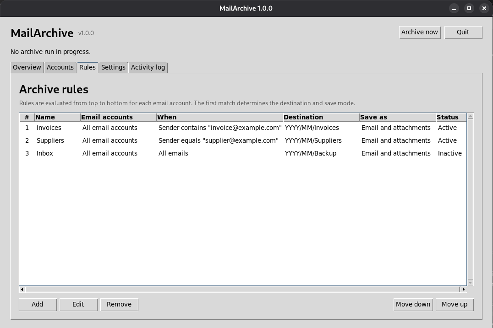

#  MailArchive

MailArchive downloads emails and attachments into local folders on Windows and Linux.
It checks your mailboxes on a schedule and uses rules to decide what to save and where.

It supports IMAP, Gmail and Microsoft Graph. Messages on the mail server stay in place
and retain their read/unread status.



Version 1.0.1 is the current stable release. It includes a more reliable Linux notification-area
integration. See the [release notes](docs/releases/1.0.1.md).

## Installation

Download the package for your platform from the [latest release](../../releases/latest).
Python is included; no separate Python installation is needed.
The packages are currently unsigned, so your operating system may show an unknown-publisher warning.

### Windows

Run `MailArchive-Setup-<version>-x64.exe`, then open MailArchive from the Start menu.
It installs for your user account without administrator rights.
Select **Create a desktop shortcut** in the installer if you also want a desktop icon.

### Linux

Download `MailArchive-<version>-x86_64.AppImage`, make it executable and start it:

```bash
chmod +x MailArchive-*.AppImage
./MailArchive-*.AppImage
```

At the first normal launch, MailArchive offers to add an application-menu entry and,
optionally, a desktop shortcut. Choose **Only run, without setup** to skip desktop
integration; the dialog will not appear again. Launching with `--minimized` never shows it.
You can configure it later under **Settings > Desktop integration > Configure...**.

Selecting a shortcut copies the AppImage and its icon into
`$XDG_DATA_HOME/mailarchive/application` (normally `~/.local/share/mailarchive/application`).
The downloaded file is left unchanged. Shortcuts and enabled login autostart point to the
installed copy, so moving or deleting the download does not break them. Setup does not need
administrator rights and will not overwrite unrelated shortcuts.

The desktop shortcut uses your configured desktop folder, including translated folder names.
If no desktop folder is available, only the application-menu option is offered. Your desktop
environment may hide desktop icons or require right-clicking the shortcut and choosing
**Allow Launching**. Clearing both options and choosing **Apply** removes managed shortcuts,
but keeps the installed AppImage, login autostart and your application data. Login autostart
is controlled separately by **Settings > General > Start automatically at login**.

The tray icon needs a StatusNotifier host. KDE Plasma provides one. On Debian or Ubuntu with
GNOME, the AppIndicator extension provides one:

```bash
sudo apt install gnome-shell-extension-appindicator
```

Enable it through GNOME Extensions, or log out and back in. Without a tray host,
MailArchive stays open as a normal window.

## Supported accounts

| Provider | Sign-in | Setup |
| --- | --- | --- |
| IMAP | Password or app password | Server, port and mailbox credentials |
| Microsoft IMAP | Microsoft OAuth (XOAUTH2) | Sign in through the browser |
| Gmail API | Google OAuth | Your own Google Desktop OAuth client, then browser sign-in |
| Gmail API | Workspace domain-wide delegation | Service-account key and administrator approval |
| Microsoft Graph | Microsoft OAuth, delegated access | Sign in through the browser |
| Microsoft Graph | Application access | Tenant ID, client ID, client secret and administrator approval |

Microsoft browser sign-in uses the registration bundled with MailArchive. Google browser
sign-in requires a Google Desktop OAuth client; the [authentication guide](docs/AUTHENTICATION.md)
explains how to create one and configure each sign-in method.
Gmail can also be connected through IMAP with an [app password](docs/GMAIL_APP_PASSWORD_SETUP.md).

An account holds one connection and its credentials. Under **Mailboxes**, add the addresses
to read through that connection. Microsoft OAuth can read your own and permitted shared
mailboxes; Microsoft application access and Workspace delegation can read several permitted
addresses. IMAP password access and Google browser sign-in read the account's own mailbox.
Each mailbox has its own folder selection and setting for existing messages.

## First run

1. In **Settings > General**, choose an **Archive folder** and polling interval.
2. In **Accounts**, choose **Add**, select the provider and sign-in method, and fill in the fields.
3. Under **Mailboxes**, choose **Add...** and enter the mailbox address. Enter folder names or
   IDs, or Gmail label IDs, one per line. Leave the list blank to read all folders or labels.
   Enable **Archive messages already present at the first check** to include older mail.
4. Save the account. For Google or Microsoft browser sign-in, select it and choose **Authorize**.
5. In **Rules**, add rules for the messages you want to save. Keep specific rules above the
   default **All remaining emails** rule.
6. Choose **Archive now** for an immediate check. Scheduled checks also run automatically.

By default, the first successful check establishes a starting point and skips existing mail.
Later checks save newly received messages. You can enable existing-mail archiving later to
include older messages that were skipped.

Settings save automatically. Checkboxes and file selections apply immediately; for a typed
path or polling interval, press **Enter** or leave the field. An unsuccessful save shows an
error and restores the previous value.

## Rules and saved files

Rules run from top to bottom. The first enabled rule that applies to the account and matches
the message decides its destination and save mode.

Choose a condition for the sender, recipient, subject, body or presence of attachments.
For example, **Sender contains @supplier.example** saves mail from that domain. Sender rules
can contain several values; matching any one is enough. Comparisons ignore case.

**All email accounts** includes accounts added later. **Selected email accounts** applies to
the chosen accounts and all their enabled mailboxes. Renaming an account keeps this selection;
a newly created replacement account must be selected separately.

Under **Save as**, choose the original email (`.eml`), extracted attachments or both.
With **Attachments only**, a matching message without attachments counts as skipped, not
archived, and the activity log explains why. No file or destination folder is created. The
message is remembered as processed so later checks do not download it again.

**Subfolder (optional)** accepts paths such as `Invoices/Supplier`. Leave it blank to save
directly in the archive folder. **Date folders** adds year/month folders using the email's
date in local time, or the current date when the email has no valid date.

For a subfolder of `Invoices/Supplier` and an email dated September 2026:

| Date folders | Path within the archive folder |
| --- | --- |
| No date folders | `Invoices/Supplier` |
| Year/month before subfolder | `2026/09/Invoices/Supplier` |
| Year/month after subfolder | `Invoices/Supplier/2026/09` |

The dialog shows a destination preview. Emails and their extracted attachments use the same
destination; attachments are placed in a separate directory for each message.

## Scheduled checks

Checks start automatically 30 seconds after launching MailArchive. Each enabled account uses
the default polling interval unless you set an override in its account settings.
**Archive now** starts a check immediately, including during the startup delay.

During a check, the status row shows progress and elapsed time. After it finishes, the totals
for checked, archived, skipped, unmatched and failed messages remain visible.
Skipped messages include previously processed mail and existing mail excluded at the first check.

MailArchive remembers which messages it has processed and uses incremental synchronization
for subsequent checks. A check with no changes will normally report zero checked messages.
Gmail and Microsoft Graph recognize messages moved between folders; IMAP can assign a new
ID after a move, so the moved message may be saved again.

Changing matching rules lets previously unmatched messages be checked again. Messages already
processed are not downloaded again when you change rules or the archive folder, or delete
their saved files. Failed downloads and saves are retried on later checks; other mailboxes
continue to be checked. Initial scans and expired synchronization tokens require a full listing.
See the [synchronization documentation](docs/PROVIDER_SYNC_CONTRACTS.md) for provider details.

Long checks automatically renew expired access tokens for Microsoft IMAP OAuth, Microsoft
Graph user/application access, Gmail user OAuth and Google Workspace service accounts, then
continue the interrupted read. Revoked authorization or expired application credentials
require signing in again or updating the account's credentials; completed work is retained.

## Opening and quitting

**Start automatically at login** starts MailArchive in your desktop session. Closing the window
keeps checks running when **Keep running in the notification area when closed** is enabled
and a tray host is available. Click the tray icon to reopen the window.

Choose **Quit** in the main window or tray menu to stop MailArchive. Logging out also stops it.
On Linux, MailArchive implements StatusNotifierItem directly rather than using the legacy Xorg
tray protocol. If no StatusNotifier host is available, MailArchive stays open as a normal window.

## Activity log and local data

**Activity log** records checks, sign-in results, warnings and errors across restarts.
Use the time filter and **Previous** / **Next** to browse it. **Clear log...** removes all log
entries, including those outside the current filter, without changing saved files or processing
history.

Settings and databases are stored here:

| Platform | Application data folder |
| --- | --- |
| Windows | `%LOCALAPPDATA%\MailArchive` |
| Linux | `$XDG_DATA_HOME/mailarchive` or `~/.local/share/mailarchive` |

The folder contains `config.json`, `archive-state.sqlite3` for processing history and
`activity-log.sqlite3` for the log. Downloaded files go into your chosen archive folder.

**Settings > Advanced** shows the database paths. You can change the processing database path;
MailArchive transfers the existing history and keeps the old database. The activity log stays
in the application data folder.

Passwords, OAuth tokens, client secrets and imported service-account keys are stored in
Windows Credential Manager or the Linux credential store, such as GNOME Keyring or KWallet.

## Updates

Choose **Overview > Check for updates** to look for a newer release. When one is available,
MailArchive offers to open its download page.
Quit MailArchive, then run the new Windows installer or use the new Linux AppImage.
For an integrated Linux installation, quit MailArchive, start the newly downloaded AppImage
and choose **Settings > Desktop integration > Configure... > Apply** with at least one
shortcut selected. This replaces the installed copy with the running version. Quit and reopen
MailArchive from its shortcut afterward. For a non-integrated AppImage, simply use the new file.
Your settings, credentials and processing history are kept separately from the application.

Database upgrades happen at startup. MailArchive creates a database backup before upgrading
an existing index. The [migration guide](docs/MIGRATIONS.md) covers upgrades and recovery.
The application version appears in the window title and header, and through `mailarchive --version`.

## Development and documentation

### Linux development setup

The Linux tray uses the StatusNotifierItem D-Bus protocol directly. It does not use the legacy
Xorg tray protocol, PyGObject, or the deprecated Ayatana AppIndicator client library.

On Debian or Ubuntu, install the two system prerequisites once:

```bash
sudo apt install python3-venv python3-tk
```

Then create the development environment and run the application:

```bash
./scripts/setup-dev.sh
source .venv/bin/activate
python -m mailarchive
```

`setup-dev.sh` creates the project's `.venv` and installs all Python dependencies, including
the Linux tray implementation. It is an editable installation: changes below `src/` take effect
the next time you start the application. No tray library needs to be installed system-wide.

To see a tray icon under GNOME, the desktop still needs a StatusNotifier/AppIndicator host such
as the GNOME AppIndicator extension described above. That extension is a desktop-shell component,
not a MailArchive development dependency.

- [Development](docs/DEVELOPMENT.md): run from source, test and build packages.
- [Authentication](docs/AUTHENTICATION.md): provider setup and permissions.
- [Gmail app passwords](docs/GMAIL_APP_PASSWORD_SETUP.md): connect Gmail through IMAP.
- [Custom Microsoft OAuth setup](docs/MICROSOFT_OAUTH_SETUP.md): use your own registration.
- [Architecture](docs/ARCHITECTURE.md): code structure and state handling.
- [Synchronization](docs/PROVIDER_SYNC_CONTRACTS.md): provider requests and checkpoints.
- [Database migrations](docs/MIGRATIONS.md): schema changes and recovery.
- [Releases](docs/RELEASE.md): versioning, package builds and publication.

## Contributing

Report bugs or suggest changes through [GitHub Issues](../../issues). For bugs, include your
MailArchive version, operating system, provider and steps to reproduce the problem.

For pull requests, keep changes focused, describe what they do and run the checks in the
[development guide](docs/DEVELOPMENT.md) before submitting.

## License

MailArchive is licensed under the [MIT License](LICENSE).
