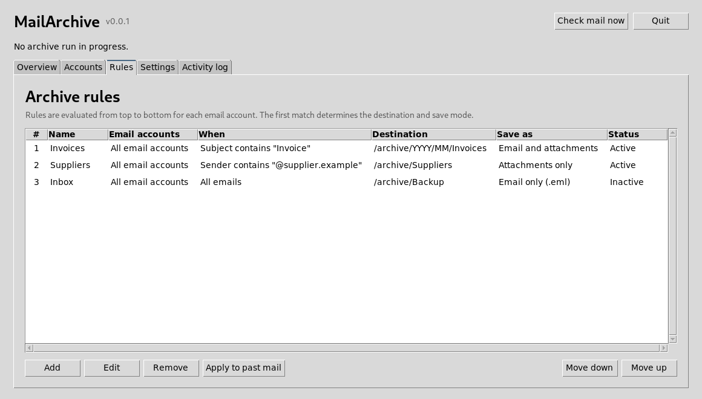

#  MailArchive

**Local email and attachment archiving for Windows and Linux.**

MailArchive is a Python desktop application that checks your mailboxes on a schedule
and saves matching emails and attachments into local folders. Connect IMAP, Gmail,
or Microsoft 365 accounts, define archive rules, and choose where each output goes.
Messages on the server stay in place and retain their read/unread status.

## Features

- **Multiple providers:** generic IMAP, Gmail API, and Microsoft Graph, with password,
  OAuth, and supported application access.
- **Flexible rules:** match sender, recipient, subject, body, or attachments, and
  limit rules to selected email accounts.
- **Multiple destinations:** save original `.eml` files, attachments, or both to one
  or more full paths, with optional year/month folders.
- **Automatic monitoring:** choose which folders or labels to watch and whether to
  include messages already present at the first check.
- **Past-mail archiving:** apply a selected rule to existing mail, optionally within
  a date range, independently of automatic rule priority.
- **Activity and recovery:** inspect jobs, history, errors, and output files; stop
  work and retry failures while keeping successful outputs.
- **Local storage:** keep archive files and processing history on your computer,
  with credentials in the operating system credential store.
- **Desktop integration:** optional login autostart and background operation through
  the notification area.



*MailArchive 0.0.1 on Linux with example archive rules.*

## Getting started

The current source version is **0.0.1**. A Windows installer and Linux AppImage are
planned for the first release; use the source instructions below for now.

### Requirements

- Python **3.10 or newer**, with Tkinter support.
- Git to clone the repository, or a downloaded copy of the source.
- An accessible email account and its provider's required authentication setup.
- A working operating system credential store: Windows Credential Manager, or a
  Linux keyring such as GNOME Keyring or KWallet.

Clone the repository and open its directory:

```bash
git clone https://github.com/PaDreyer/mailarchive.git
cd mailarchive
```

### Linux

On Debian or Ubuntu, install Python's virtual-environment and Tkinter support if needed:

```bash
sudo apt install python3-venv python3-tk
```

Create an environment, install MailArchive, and start it:

```bash
python3 -m venv .venv
.venv/bin/python -m pip install -e .
.venv/bin/python -m mailarchive
```

### Windows

In PowerShell, using a Python installation with Tcl/Tk support:

```powershell
python -m venv .venv
.\.venv\Scripts\python.exe -m pip install -e .
.\.venv\Scripts\python.exe -m mailarchive
```

### First archive

1. In **Accounts**, choose **Add**, select your provider and authentication method,
   and enter the connection details.
2. Under **Mailboxes**, add the mailbox address and the folders or label IDs to
   read. Choose whether to archive messages already present at the first check.
3. Save the account. For browser sign-in, select it and choose **Authorize**.
4. In **Rules**, add an enabled rule with a matching condition and a full destination
   path, such as `/home/alex/Archive/Invoices` or `C:\Archive\Invoices`.
5. Choose **Check mail now**, then open **Overview → Archive activity** to inspect
   the results. To archive earlier mail explicitly, select a rule and choose
   **Apply to past mail**.

MailArchive checks an enabled account only when it has an enabled rule that applies
to that account. A profile without such rules makes no mailbox requests and keeps
its synchronization state unchanged. The sections below explain the provider setup
and rule options in more detail.

## Configuration

### Accounts and mailboxes

An account holds a connection and its credentials. Its **Mailboxes** list selects
which mailbox addresses to read through that connection.

| Provider | Sign-in options | Mailbox access |
| --- | --- | --- |
| Generic IMAP | Password or app password; Microsoft OAuth for Microsoft IMAP | The login's mailbox; permitted shared mailboxes with Microsoft OAuth |
| Gmail API | Google OAuth; Workspace domain-wide delegation | The signed-in account; delegated Workspace users with application access |
| Microsoft Graph | Microsoft delegated OAuth; application access | Own and permitted shared mailboxes; mailboxes permitted for the application |

Google browser sign-in requires your own Google Desktop OAuth client. Microsoft
browser sign-in uses the application registration bundled with MailArchive.
Workspace delegation and Microsoft application access require administrator setup.
See [Authentication](docs/AUTHENTICATION.md) for the complete instructions, or the
[Gmail app-password guide](docs/GMAIL_APP_PASSWORD_SETUP.md) to connect Gmail over IMAP.

Enter folder names or IDs, or Gmail label IDs, **one per line**. Spaces in folder
names are preserved. Leave the list blank to read all accessible folders or labels.

Enable **Archive messages already present on the first check** to include existing
mail when a folder is first checked. Otherwise, that first check records a baseline
and later checks process newly discovered messages. Changing the option later only
affects folders that have not yet been checked; use **Apply to past mail** for
folders already monitored. Checks skipped while an account has no active rule do
not establish a baseline, so its first actual check still follows this option.

### Rules and destination paths

Rules run in priority order. The first enabled rule whose account scope and
conditions match chooses all destinations for that message. Put specific rules
above broader ones, and use **Move up** or **Move down** to change their priority.
Every rule can be removed; an empty rule list saves nothing.

Each destination uses a **full path** and selects email, attachments, or both.
Choose whether attachments go directly into the destination or into a separate
folder for each message. The rule editor's **Destinations** section shows one block
per destination, with its path, preview, save format, and attachment placement.
Use **Add destination** to add another output and **Remove** to remove any destination
while keeping at least one. Additional destinations scroll within the existing
section without enlarging the window; **Save** applies all changes and **Cancel**
leaves the rule unchanged. **Choose folder** opens the system folder picker,
where you can create a new folder before selecting it. On Linux without a suitable desktop portal,
MailArchive offers its own picker with **New folder**. Created folders remain even
if you cancel the selection. Missing subfolders are also created when files are written.

`{year}` and `{month}` use the provider's reception time in the timezone selected
under **Settings → General → Archive date timezone**. For example, with a message
received in September 2026:

| Destination template | Resulting folder |
| --- | --- |
| `/home/alex/Archive/{year}/{month}/Invoices` | `/home/alex/Archive/2026/09/Invoices` |
| `C:\Archive\Invoices\{year}\{month}` | `C:\Archive\Invoices\2026\09` |

Use `{{` and `}}` for literal braces. Archived email retains its original `.eml`
format, and attachment filenames are made safe for the destination filesystem.
Existing unrelated files are not overwritten or counted as earlier archive successes.

### Monitoring and past mail

Automatic checks begin 30 seconds after startup and follow the polling interval in
**Settings → General**, unless an account has its own interval. **Check mail now**
starts a check immediately for enabled accounts with at least one enabled rule in
their account scope. Rule conditions are evaluated only after discovery; they do
not affect whether an account is eligible for checking. A newly discovered message
can have an old reception date, for example after a provider import.

Accounts without an applicable active rule show **Waiting for an active rule**.
They keep their cursor, baseline, and last-check state unchanged. If no account is
eligible, **Check mail now** immediately displays **No mail checked. Create or enable
a rule for an enabled email account.** without starting a check. With no enabled
mailboxes it displays **No enabled mailboxes to check.** If only some accounts are
eligible, the completion message reports how many were skipped. Automatic polling
silently skips accounts without active rules.

During a manual check, the button becomes **Stop check**. It stops the complete
check, including downloads and archive outputs. **Stopping** remains visible until
the current step has safely ended. Completed files are kept; automatic checks and
unfinished work may continue after the configured polling interval. **Check mail now**
can start them sooner.

To process older mail, select an enabled rule and choose **Apply to past mail**.
It covers every enabled mailbox in that rule's account scope, using the configured
folders or labels. The dialog accepts an optional inclusive date range and timezone.
Only the selected rule applies, regardless of other rules' priority. Saving a rule
alone does not start a run, and this explicit run does not change automatic monitoring's
starting point.

Repeating a past-mail run can add outputs after a rule change without duplicating
identical outputs already tracked by MailArchive. It does not recreate archive files
that you manually deleted.

### Activity, stopping, and retries

Open **Overview → Archive activity** for **Current jobs** and **History**. Select a
job to inspect its mailboxes, attempts, messages, individual outputs, and errors.
**Load more** shows older history. Empty successful checks update monitoring health
without adding an archive job.

**Stop selected job** stops the whole selected past-mail operation, including its
remaining scans and outputs. Files already saved remain saved; stopped operations
do not resume automatically. **Retry selected failure** continues eligible failed
or interrupted work from its saved selection. Once mail has been fully accepted
locally, outputs can retry from the local raw copy without another download.

Automatic retries of incomplete downloads pause while their account has no current
applicable enabled rule. Accepted archive jobs with a local message copy can still
finish their outputs using the saved rule. Re-enabling an account's rule resumes
discovery from its preserved cursor. Messages previously skipped at a baseline or
marked as unmatched remain unchanged; use **Apply to past mail** to process them.

A reused successful output appears as **Previously archived**, with its original
completion time. **Open selected output** opens a specific completed file and reports
if it is now missing. The separate **Activity log** records checks, warnings, and errors.

### Desktop behavior and settings

Under **Settings → General**, configure the polling interval, archive date timezone,
login autostart, notifications, and notification-area behavior. Settings save
automatically; for text fields, press **Enter** or leave the field.

Closing the window keeps monitoring active when notification-area operation is enabled
and a tray host is available. Click the tray icon to reopen the window, or choose
**Quit** in the window or tray menu to stop MailArchive. On Linux, the tray requires a
StatusNotifier host, such as KDE Plasma or GNOME with an AppIndicator extension.
Without a tray host, MailArchive remains a normal window.

### Local data and credentials

Configuration, processing history, output receipts, and the activity log share a
local `workspace.sqlite3` profile database. Accepted raw mail is kept in an adjacent
`work` folder until its requested outputs settle.

| Platform | Default profile directory |
| --- | --- |
| Windows | `%LOCALAPPDATA%\MailArchive` |
| Linux | `$XDG_DATA_HOME/mailarchive`, or `~/.local/share/mailarchive` |

Change the profile path under **Settings → Advanced → Database**. An existing
MailArchive database opens that profile; a new path creates an empty profile.
The previous database stays unchanged. Each database needs its own directory for
its adjacent work files. A small location file in the default data directory
remembers the selected profile for the next start.

Passwords, OAuth tokens, client secrets, and service-account keys remain in the
operating system credential store. Version 0.0.1 uses a fresh profile format and
does not import settings or history from earlier prototypes. Incompatible or
damaged profile databases are rejected.

## Development

Install the test and quality tools into the environment created above:

```bash
.venv/bin/python -m pip install -e '.[test,quality]'
```

Run the repository checks:

```bash
.venv/bin/python -m ruff check src tests
.venv/bin/python -m ruff format --check src tests
.venv/bin/python -m coverage run -m unittest discover -s tests -v
.venv/bin/python -m coverage report
```

On Windows, replace `.venv/bin/python` with `.\.venv\Scripts\python.exe`.
Tests use temporary profiles and fake providers. GUI tests need a display; on
headless Linux, run the coverage command through `xvfb-run -a`.

See [Development](docs/DEVELOPMENT.md) for GUI smoke checks, coverage requirements,
and Windows installer/Linux AppImage builds. See [Architecture](docs/ARCHITECTURE.md)
for the application boundaries and [Release procedure](docs/RELEASE.md) for versioning
and publication.

## Contributing

Bug reports, feature suggestions, and pull requests are welcome.

- Open a [GitHub issue](https://github.com/PaDreyer/mailarchive/issues) with your
  MailArchive version, operating system, provider, and steps to reproduce the problem.
- Keep [pull requests](https://github.com/PaDreyer/mailarchive/pulls) focused, describe
  the resulting behavior, and run the relevant checks from the development section.
- Include tests for behavior changes and update documentation when the user workflow changes.
- Remove credentials and private email content from logs, screenshots, and examples you share.

## Documentation

- [Authentication](docs/AUTHENTICATION.md): provider setup and sign-in methods.
- [Gmail app passwords](docs/GMAIL_APP_PASSWORD_SETUP.md): connect Gmail through IMAP.
- [Custom Microsoft OAuth setup](docs/MICROSOFT_OAUTH_SETUP.md): use your own registration.
- [Development](docs/DEVELOPMENT.md): tests, GUI verification, and package builds.
- [Architecture](docs/ARCHITECTURE.md): modules, persistence, processing, and recovery.
- [Provider synchronization](docs/PROVIDER_SYNC_CONTRACTS.md): message identities,
  reception times, discovery, and retry contracts.
- [Release procedure](docs/RELEASE.md): versioning and publication.

## Limitations

- Gmail and Graph recognize message identities across labels or folders within one
  mailbox. Generic IMAP uses folder, UIDVALIDITY, and UID; a move can appear as a new
  source occurrence. A UIDVALIDITY change pauses the folder until you choose a new
  baseline or an explicit range. MailArchive does not deduplicate across providers
  or mailboxes using Message-ID, dates, or identical content.
- Reception times come from the provider. A missing provider reception time is an
  intake error; it is not replaced by the email's Date header.
- A message is limited to **256 MiB** of raw data. The work folder is limited to
  **2 GiB**, with a **64 MiB** disk reserve and at most **256 unresolved intakes**.
  Capacity failures appear in Archive activity and do not advance the affected cursor.
- A provider message that disappears before complete local intake may fail to archive.
  Fully accepted local work can finish without another provider download.
- MailArchive reports filesystem write errors, but cannot detect a missing mount
  when its path remains locally writable.

## License

MailArchive is released under the [MIT License](LICENSE).

Copyright © 2026 Paul Dreyer.
