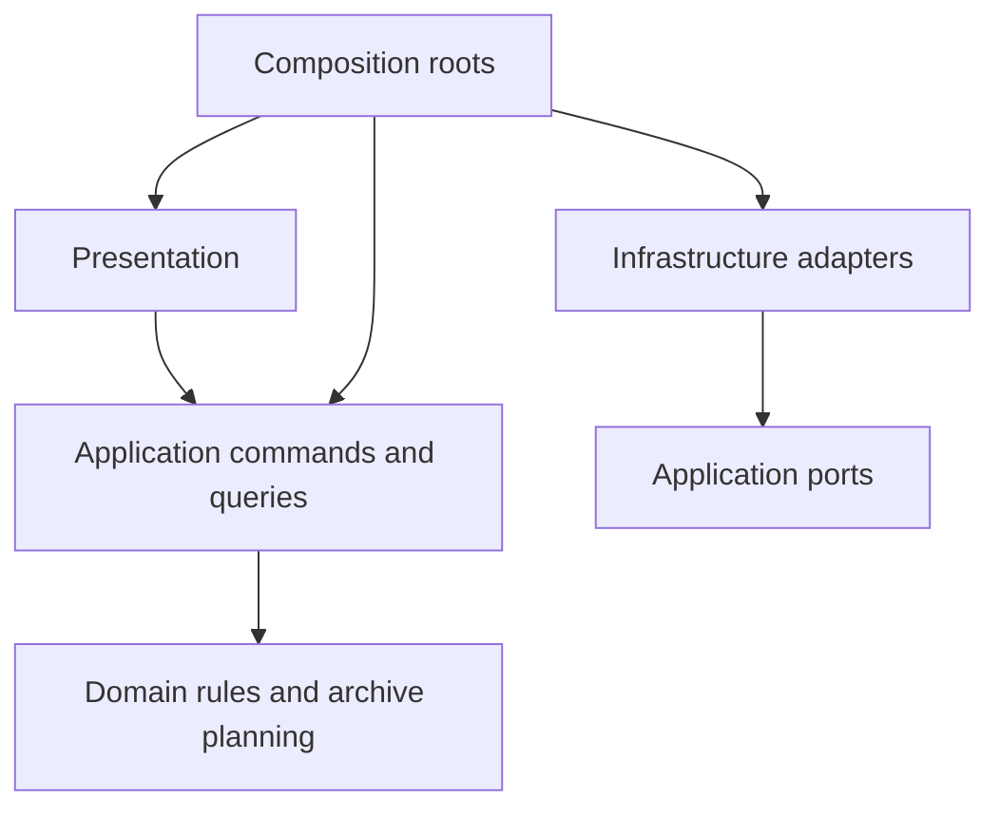

# MailArchive architecture

MailArchive is a local, modular desktop application. Its purpose is to save matching mail and attachments reliably at user-selected filesystem locations. The source mailbox is read-only. Rules automate recurring work; explicit past-mail processing applies a selected rule to a bounded set of mailboxes. The application does not turn every empty monitoring check into a user-visible job.

## Boundaries

| Boundary | Owns | Does not own |
| --- | --- | --- |
| `domain` | Configuration models, source identity, rule matching, MIME parsing, destination and artifact planning | SQLite, Tk, network requests, filesystem writes |
| `application` | User actions, execution scheduling, lifecycle, provider contracts, activity queries and typed read models | SQL queries, widget state, provider HTTP/IMAP implementation |
| `infrastructure` | SQLite repositories, safe retained mail storage, output publication and provider/platform adapters | UI navigation or independently chosen processing policy |
| `presentation` | Tk views, form input and display of application results | Processing threads, database records, service construction |
| `bootstrap.py` | Concrete dependency construction for one profile | Rule evaluation or widget behavior |

Dependencies point toward domain and application contracts. Presentation calls the application facade. SQL projections implement typed activity reader contracts. Provider adapters implement the source port. Dependency tests enforce these import boundaries across all four packages. `app.py` composes native UI integration; `bootstrap.py` composes profile services.

`ProfileDatabase` constructs configuration, discovery, operation and delivery repositories over one connection policy. It also coordinates startup recovery with retained-file cleanup. It does not expose a combined processing API. Profile integrity validation is shared by profile opening and repository writes. `ArchiveEngine` receives spool and output-file ports; its publication and pending-file recovery policy does not depend on concrete filesystem calls.

The architecture uses the existing single process, SQLite and Tk stack. It does not require a service bus, server, generic repository per table, or a second active processing implementation.

## Configuration and source identity

An account owns authentication and one or more mailbox identities. A rule owns one canonical list of targets. Each target specifies its full path template, saved content and attachment placement. There are no mirrored first-target fields or global archive-root fallback. The first enabled, account-scoped matching rule wins during normal monitoring. Explicit past-mail processing evaluates only its selected rule.

Settings are stored as immutable revisions with one active revision. A processing selection refers to the exact settings it uses. Accepted mail work stores the rule, targets, archive timezone and provider reception time needed to finish independently of later edits. The facade returns detached settings snapshots; account changes use a guarded configuration/credential operation with credential rollback if persistence fails.

Credentials remain in the operating system credential store. SQLite contains configuration, source discovery state, processing records, output receipts and diagnostic events, but no credentials.

Mailbox IDs remain stable while a mailbox binding is unchanged. Generic IMAP identifies source occurrences by folder, UIDVALIDITY and UID. Gmail IDs and Graph immutable IDs identify messages across labels/folders within one mailbox. Message-ID, date or identical content never merges distinct source identities. Changed IMAP UIDVALIDITY requires an explicit new baseline.

## Discovery and archival

The shared archival path is:

1. Discover a candidate within the selected source scope.
2. Reserve its source identity durably.
3. Read bounded raw chunks into local retained storage.
4. Evaluate the selected rule and freeze the required outputs.
5. Publish each output safely and record its result.
6. Retain raw mail until its required work is finished or explicitly discarded.

Automatic discovery establishes a baseline per selected scope. The mailbox's first-check option determines whether that baseline is archived or only observed. New discovery is based on provider identities and cursors, not solely on message dates; a newly imported old message can be new work. Adding a scope creates its own baseline. Rule edits do not silently reprocess previously observed mail.

Past-mail processing owns a frozen rule, timezone/range and ordered set of enabled mailboxes. Per-mailbox scans and continuation checkpoints belong to that operation. Manual checkpoints never advance automatic cursors. Provider filtering only narrows candidates; exact received-time boundaries are checked locally. Provider-specific synchronization details are defined in [Provider synchronization](PROVIDER_SYNC_CONTRACTS.md).

The execution coordinator owns one processing worker for polling, explicit checks, past-mail processing and targeted retries. UI calls submit commands; dialogs do not create processing threads. A source search finishing is distinct from all required archive outputs succeeding.

## Stop and recovery

An explicit operation is persisted before its work is queued, making it immediately visible. Stop persists a `stopping` gate for the whole operation. Every subsequent mailbox, page, intake and output checks that gate. Output retry and startup recovery also honor it.

An atomic file publication already in progress may finish and record its receipt. The worker then settles the operation as `stopped`; incomplete work is retained and excluded from automatic execution. Existing archive files are kept. A stopped operation is never silently resumed. Crash interruption and deliberate stopping remain distinct states.

A **Check mail now** request has a runtime execution ID and its own stop signal. The coordinator owns queued/running/stopping and completed/stopped/failed transitions and emits one terminal event for each accepted check. Services report processing details; they do not publish execution completion. Progress includes execution ID, origin and sequence so delayed UI callbacks cannot replace the state of another check. The tray's check command remains a start command; the main button changes from **Stop check** to disabled **Stopping** until the worker settles.

Check cancellation is passed through discovery, intake, saved output retries and provider adapters. Folder enumeration, baseline scans, pagination, token refresh, download chunks and output publication all observe it. An in-flight network read may return or time out; an in-flight atomic publication records its receipt before stopping. Partial downloads are discarded, reservations and accepted work remain retryable, and unfinished scans retain the existing `interrupted` status with a user-stop reason. Cancellation does not invent a provider error or advance an unfinished cursor.

After a check stops, every affected source is deferred until stop completion plus its account's polling interval. The same source exclusion is used both to detect due work and to execute saved intake/output work, including waiting past-mail outputs. Retained work whose account is no longer configured uses its saved settings (the newest retained configuration for that source). An explicit new check bypasses these runtime deferrals. Restart retains the existing startup scheduling behavior. Check execution IDs and deferrals require no profile schema change; actual mail work remains in Archive activity and the stop is recorded in diagnostics.

Shutdown signals the worker and waits for it to stop. Profile replacement cannot rebind live services to another database. A replacement profile has freshly composed services. Failure to open/start it restores the previous profile; timeout recovery must not leave monitoring silently disabled. Background authorization is cancelled before a profile switch, and late browser results cannot publish credentials after cancellation.

## Retained mail and files

The local spool owns raw-file staging, hashing, bounded reads, safe cleanup and capacity limits. It has no SQL dependency. SQLite repositories determine which paths must be retained. The spool verifies directory/file types, avoids following symlinks, and pins directory handles where supported.

One raw message is limited to 256 MiB; total retained storage is limited to 2 GiB with a 64 MiB disk reserve. At most 256 unresolved intakes may reserve messages. Capacity failures remain visible and do not advance the affected discovery checkpoint. Provider messages that disappear before complete local intake are not protected; accepted local work can finish after remote deletion.

Artifact planning is pure. It produces each artifact's identity, bytes, hash and requested destination using the frozen rule and reception time. The file writer publishes without replacement. Unrelated existing files receive a collision suffix.

SQLite and external files do not share an atomic transaction. The persistent planned-path, publish, verify and receipt sequence closes the crash gap. A pending output can recognize its own preselected path only after checking its content. Receipts identify source, message, artifact, content and requested destination. A rule ID or an arbitrary identical file is insufficient evidence of prior success.

Successful outputs are not repeated when another target fails. Retry uses retained input and the original plan. Output attempts preserve previous failures and successes. Removing a saved archive manually does not make an ordinary later run an archive-integrity repair operation.

## Activity and diagnostics

`Archive activity` contains `Current jobs` and `History`, both projected from the same durable processing state. A past-mail operation is one entry with nested mail and output results. Automatic actual mail work appears individually. Intake-to-accepted-work transitions do not create duplicate sibling entries. Empty successful monitoring checks update source health rather than adding jobs.

Details expose concrete output paths, errors and attempts. Actions are attached to the selected activity. Stop targets the complete selected operation. Retry targets eligible failed/interrupted work. Opening a file uses a specific successful output; there is no global destination-opening command.

The diagnostic activity log is separate from business outcomes. Clearing it does not remove settings, receipts, work or archived files. Log persistence belongs to the profile event sink, so a destroyed or closing window cannot lose a processing outcome.

## Profile format and verification

The first release, 0.0.1, starts with profile schema 1. There are no existing users or data to migrate; unpublished prototype changes do not represent released schema versions. Future schema upgrades will be designed for actually published profile formats. The profile format rejects incompatible or damaged databases; it never silently deletes or imports them. Selecting a fresh database creates an empty profile. Each profile has its own parent directory and adjacent retained-work directory. A small location file records the selected database path; its publication is coordinated with profile lifecycle.

Verification exercises complete paths with temporary profiles, fake providers and real output files: baseline/new discovery, multiple mailboxes and targets, Stop during publication, remote deletion after intake, target failure/retry, crash between publication and receipt, immutable rule selections, failed profile switches and paginated activity. Tk tests run against a virtual display. [Development](DEVELOPMENT.md) contains the commands and platform limits.
